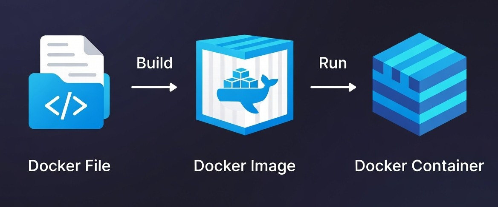

# Docker Mastery Lab 2026 🐳

A comprehensive guide from absolute beginner to industrial-level Docker expert. This repository documents my journey through containerization, architecture, and production-grade orchestration.

---

## Table of Contents

- [What is Docker?](#what-is-docker)
- [The Three Core Parts](#the-three-core-parts)
- [Why is it Useful?](#why-is-it-useful)
- [Docker Architecture and Working](#docker-architecture-and-working)
- [Components of Docker](#components-of-docker)
  - [Docker Engine](#docker-engine)
  - [Dockerfile](#dockerfile)
  - [Docker Image](#docker-image)
  - [Docker Container](#docker-container)
  - [Docker Hub](#docker-hub)
  - [Docker Registry](#docker-registry)
- [Docker Commands](#docker-commands)

---

## What is Docker?

Docker is a tool that lets you wrap your application and everything it needs (libraries, settings, code) into a single "package." This package can then run on any computer—whether it's your laptop or a massive server—and it will behave exactly the same way every time.

---

## The Three Core Parts

**Dockerfile (The Instructions)**  
A simple text file where you write down the steps to set up your app (e.g., "Install Node.js," "Copy my code here").

**Image (The Package)**  
A permanent "snapshot" created from your Dockerfile. It contains your app and all its dependencies in a single file that never changes.

**Container (The Running App)**  
A live, active version of your Image. You can start, stop, or delete containers without messing up your computer's actual settings.

---

## Why is it Useful?

- **Portability** – Runs anywhere: local machines, cloud, or on-prem servers.
- **Consistency** – Same behavior in development, testing, and production.
- **Lightweight** – No full OS per app; containers share the host kernel.
- **Scalability** – Ideal for microservices and orchestrators like Kubernetes.
- **Efficiency** – Starts in seconds and uses fewer system resources.

---

## Docker Architecture and Working

Understanding how Docker works becomes much easier when you look at it as a system of three main parts working together.

### 1. The Docker Client (The Messenger)

The **Client** is the primary way you interact with Docker. It is the terminal or command-line interface (CLI) where you type your commands.

**Role:** It doesn't do the heavy lifting; its only job is to take your orders (like `docker run`, `docker build`, or `docker pull`) and pass them to the "Boss" (the Daemon).

### 2. The Docker Daemon (The Boss)

The **Daemon** (`dockerd`) is the engine that lives inside your computer. It stays in the background and does all the actual work.

**Role:** When it receives a message from the Client, it:
- Finds the right **Images**
- Builds and manages **Containers**
- Handles **Networking** and **Storage** so everything runs smoothly

### 3. The Docker Registry (The Library)

The **Registry** is a massive online library where ready-to-use "blueprints" (Images) are stored.

**Role:** If you need a specific environment like Ubuntu, Node.js, or Nginx, you don't have to build it from scratch.

**Action:** You "pull" it from the Registry, and the Daemon downloads it for you.

**Note:** Docker Hub is the most popular public registry.

---

### The Process in Brief

1. **User Request** – You send requirements to the Client.
2. **Command Transfer** – The Client passes instructions to the Daemon.
3. **Image Retrieval** – The Daemon fetches missing images from the Registry.
4. **Management** – The Daemon runs and oversees the containers.

---

## Components of Docker

**Docker Engine**  
Docker Engine has a core part called the Docker daemon, which handles the creation and management of containers.

**Dockerfile**  
It is a file that describes the steps to create an image quickly.

**Docker Image**  
A Docker Image is a read-only template used for creating containers, containing the application code and dependencies.

**Docker Hub**  
It is a cloud-based repository used for finding and sharing container images.

**Docker Registry**  
It is a storage distribution system for Docker images, where you can store images in both public and private modes.

---

### Docker Engine

Without the [Docker Engine](./docs/DockerEngine.md), Docker images cannot be built or containers executed.

- The Client sends Docker commands (`docker build`, `docker run`, etc.)
- The Daemon receives these commands and performs container operations
- The REST API is the interface enabling this communication

---

### Dockerfile

A [Dockerfile](./docs/DockerFile.md) is a simple text file that acts like a recipe for your app. It uses a special set of commands to tell Docker exactly how to build an image. Since the Docker Daemon reads these instructions from top to bottom, the order of your steps is very important. Once it finishes reading the list, you have a completed Image ready to run.

---

### Docker Image

A [Docker Image](./docs/DockerImage.md) is a file made up of multiple layers that contains the instructions to build and run a Docker container. It acts as an executable package that includes everything needed to run an application: code, runtime, libraries, environment variables, and configurations.

**Docker Image** → Blueprint (static, read-only)  
**Docker Container** → Running instance of that image (dynamic, executable)

---

### Docker Container

A [Docker Container](./docs/DockerContainer.md) is a lightweight, runnable instance of a Docker Image. It packages the application code together with all its dependencies and runs it in an isolated environment.

A container is created when a Docker Image is executed. It runs an isolated process on the host machine but shares the host's operating system kernel.

**Docker Image** = Blueprint (static, read-only)  
**Docker Container** = Live instance of that blueprint (dynamic, executable)

---

### What is Docker Hub?

[Docker Hub](./docs/DockerHub.md) is a repository service and a cloud-based service where people push their Docker Container Images and also pull Docker Container Images from Docker Hub anytime or anywhere via the internet.

---

## Docker Commands

Important [Docker Commands](./docs/DockerCommands.md):

**`docker run`**  Used for launching containers from images, specifying runtime options and commands.

**`docker pull`**  Fetches container images from a container registry like Docker Hub to the local machine.

**`docker ps`**  Displays running containers along with important information like container ID, image used, and status.

**`docker stop`**  Halts running containers gracefully, shutting down processes within them.

**`docker start`**  Restarts stopped containers, resuming operations from the previous state.

**`docker login`**  Logs in to a Docker registry, enabling access to private repositories.

---

**Happy Dockering! 🐳**