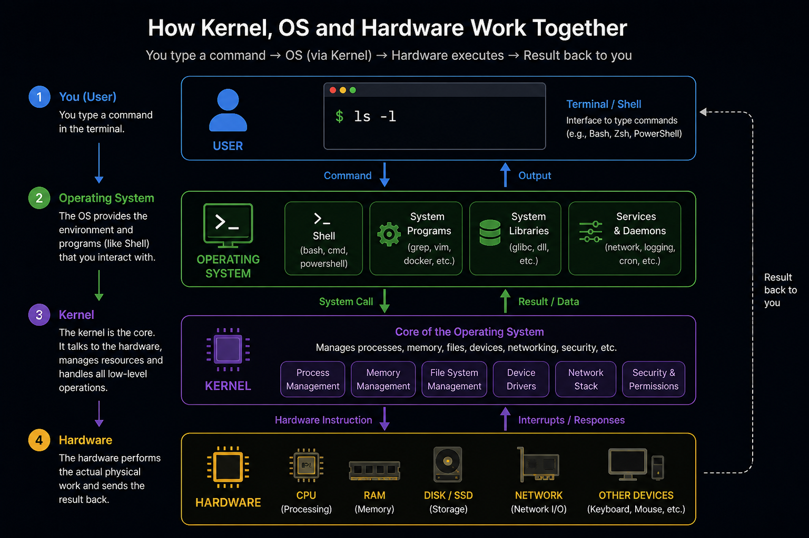
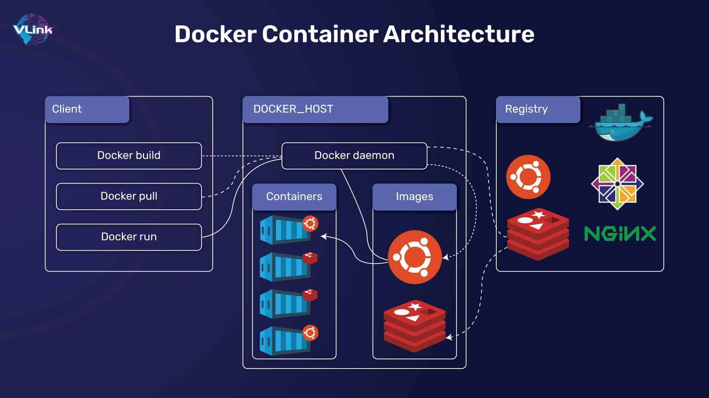

## Docker Container

A Docker Container is a lightweight, runnable instance of a Docker Image. It is the live, running version of your application.

---

### What is a Docker Container?

A Docker Container packages an application with all its dependencies and runs it in an isolated environment. When you execute a Docker Image, you get a running Container.

Think of a Container as a separate box on your computer. Inside that box, your application runs with its own libraries and settings, without touching anything outside the box.

---

### Understanding Kernel, OS, and Hardware

Before understanding Containers, know these three things:

**Hardware** – The physical parts of your computer (CPU, RAM, Disk)

**Kernel** – The middleman between OS and Hardware. It talks directly to the hardware.

**Operating System (OS)** – The full software package (Kernel + Desktop + Apps + Tools)

**Simple Line:** Kernel is the core. OS is the whole thing. Hardware is the physical machine.

**Example:** Linux is a Kernel. Ubuntu is an OS (Ubuntu = Linux Kernel + Desktop + Apps)

---

### Why This Matters for Docker

**Virtual Machine** – Has its own full OS (Kernel + everything). Heavy and slow.

**Docker Container** – Shares the host's Kernel. No full OS needed. Light and fast.

---

### The Simple Analogy

To understand Docker Container, think of a house:

- **Docker Image** – The blueprint of the house (plan, design)
- **Docker Container** – The actual built house you can live in

Or think of software:

- **Docker Image** – A recipe for a dish
- **Docker Container** – The cooked dish ready to eat

---

### Key Characteristics

**Lightweight** – Containers share your host machine's kernel. They do not need a full OS inside them.

**Isolated** – Each Container runs in its own environment. It cannot see other Containers unless allowed.

**Portable** – A Container runs the same way on any machine.

**Stateless by Default** – When a Container is deleted, everything inside is lost unless saved.

---

### Container Lifecycle

- **Created** – Container created from Image but not running
- **Running** – Container is actively executing
- **Paused** – Container is frozen temporarily
- **Stopped** – Container is shut down but still exists
- **Deleted** – Container is removed completely

---

### Docker Image vs Docker Container

- **Docker Image** – Blueprint (static, read-only, cannot change)
- **Docker Container** – Live instance (dynamic, executable, can change)

You can create many Containers from the same Image. Each runs independently.

---

## Docker Container Architecture

