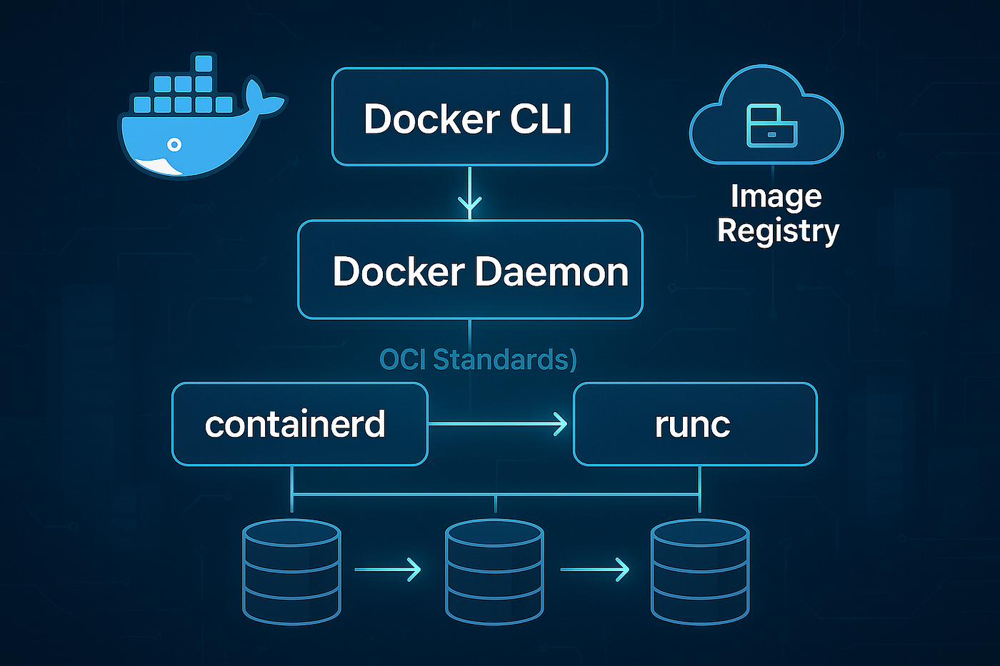

## Docker Engine

Docker Engine is the core software that runs and manages containers on your system. It is the foundation of everything Docker.

---

### What is Docker Engine?

Docker Engine is a client-server application that builds, runs, and distributes containers. It is the layer where all container operations actually happen.

Without Docker Engine, you cannot build images, run containers, or use any Docker commands.

---

### The Simple Analogy

To understand Docker Engine, think of it like a car:

- **Docker Engine** – The entire car (all parts working together)
- **Docker Daemon** – The engine under the hood (does the actual work)
- **Docker Client** – The steering wheel and pedals (you control it)

---

### Main Components of Docker Engine

**1. Docker Daemon (`dockerd`)**  
The Daemon is the background service that runs on your host machine. It listens for Docker API requests and manages container objects like images, containers, networks, and volumes.

**2. Docker Client (`docker`)**  
The Client is the command-line tool you use to interact with Docker. When you type `docker run`, the Client sends that command to the Daemon.

**3. REST API**  
The API is the communication layer between the Client and the Daemon. It allows other tools and applications to talk to the Daemon programmatically.

---

### How Docker Engine Works

1. You type a Docker command in the terminal (Client)
2. The Client sends the request to the Daemon via REST API
3. The Daemon receives the request and executes it
4. The Daemon creates, starts, or stops containers as instructed
5. The result is sent back to the Client

---

### Where Does Docker Engine Run?

- **Linux** – Docker Engine runs natively
- **Windows & macOS** – Docker Engine runs inside a lightweight Linux virtual machine

---

### Docker Engine vs Other Components

- **Docker Engine** – Does the actual work
- **Dockerfile** – Provides the instructions
- **Docker Image** – The blueprint created
- **Docker Container** – The running instance

---

### Key Points to Remember

- Docker Engine is sometimes simply called "Docker"
- It is free and open-source
- It uses your host machine's kernel, not a full OS
- All container operations depend on the Engine

---

